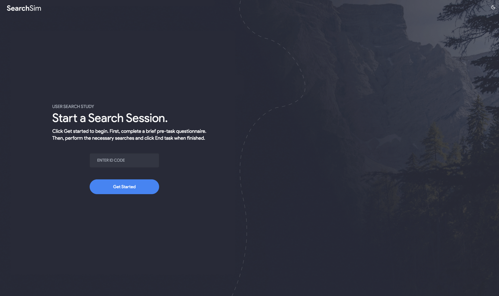

# SearchLab: Exploring Conversational and Traditional Search Interfaces in Information Retrieval

Source code for our paper :  
***SearchLab: Exploring Conversational and Traditional Search Interfaces in Information Retrieval***

The recent advancements in Large Language Models (LLMs) have led to increased popularity of conversational search systems and traditional search engines (SERPs). Consequently, studying user behavior and search queries across various search systems has become a critical research area in information retrieval (IR). However, researchers often face challenges in developing experimental search engine systems to collect user data during searches or user studies. This paper introduces SearchLab, a modular and extensible search framework designed for rapid prototyping and conducting controlled user studies. SearchLab facilitates the collection of comprehensive user interaction data, including query and click logs, relevant documents, and user activity. The framework integrates components of modern search systems with LLM capabilities, enabling seamless switching between different search paradigms while maintaining experimental reproducibility. To demonstrate the framework's capabilities, we conducted three parallel user studies: a temporal comparison of traditional search behavior using TREC 2014 Track Session topics, an analysis of pure conversational search interactions, and an examination of user behavior in a hybrid search environment combining both paradigms. These studies provide preliminary insights into how users adapt their search strategies across different interfaces. SearchLab's extensible architecture and comprehensive data collection capabilities make it a valuable tool for researchers studying the future of multi-modal information retrieval.

## Overview


https://github.com/saberzerhoudi/searchlab/assets/90967502/183ed1a6-0529-421c-bfc9-07a2eaa7265d
<!-- <p align="center">
  
</p> -->

## Quick Start

### Prerequisites

- [Docker](https://docs.docker.com/get-docker/)
- [Ollama](https://ollama.com/download)
  - Download any of the supported models: **llama3**, **mistral**, **gemma**
  - Start ollama server `ollama serve`


### 1. Clone the Repo

```
git clone https://github.com/padas-lab-de/searchlab
cd searchlab
```

### 2. Add Environment Variables
```
touch .env
```

Add the following variables to the .env file:

#### Required
```
BING_API_KEY=...
```

#### Optional Variables (Pre-configured Defaults)
```
# API URL
NEXT_PUBLIC_API_URL=http://localhost:8000

# Local Models
NEXT_PUBLIC_LOCAL_MODE_ENABLED=true
ENABLE_LOCAL_MODELS=True
```


### 3. Run Containers
This requires Docker Compose version 2.22.0 or later.
```
docker-compose -f docker-compose.dev.yaml up -d
```


Visit [http://localhost:3000](http://localhost:3000) to view the app.

